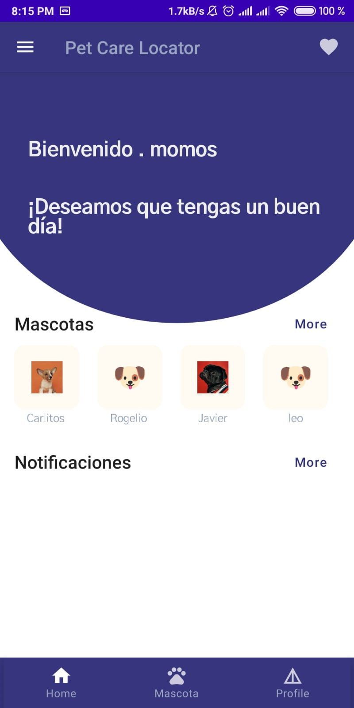
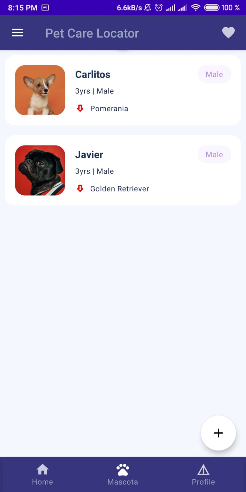
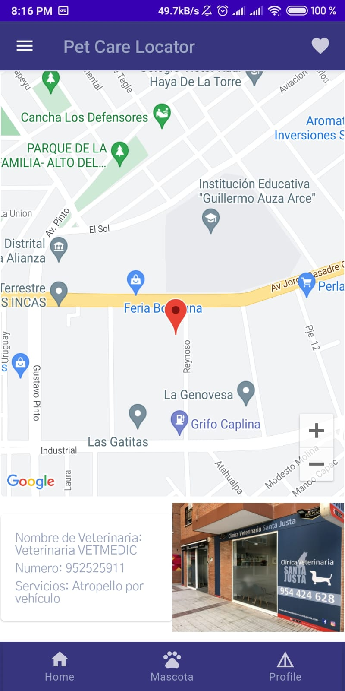

# Pet Care Locator

Pet Care Locator es una aplicación móvil que utiliza Jetpack Compose junto con una arquitectura MVVM (Model-View-ViewModel) para ayudar a los usuarios a encontrar veterinarias cercanas en caso de emergencia. La aplicación utiliza Firestore Database y Storage para almacenar y recuperar la información necesaria.

La función principal de Pet Care Locator es proporcionar a los usuarios la ubicación de las veterinarias cercanas a su posición actual, utilizando la API de Google Maps. Esto permite a los usuarios encontrar rápidamente la ayuda que necesitan para sus mascotas en caso de una emergencia médica.

## Características principales

- Ubicación actual: La aplicación obtiene la ubicación actual del usuario utilizando la API de Google Maps.
- Búsqueda de veterinarias cercanas: Pet Care Locator utiliza la ubicación actual del usuario para encontrar las veterinarias más cercanas.
- Información detallada de la veterinaria: Los usuarios pueden obtener información detallada sobre cada veterinaria, como horarios de atención, servicios ofrecidos y comentarios de otros usuarios.

## Capturas de pantalla

| Home | Pet | Location |
| :------: | :------: | :------: |
|  |  |  |


## Configuración

Para compilar y ejecutar el proyecto localmente, sigue estos pasos:

1. Clona el repositorio de GitHub:

   ```
   https://github.com/epis-upt-flor/proyecto-final-petcare_ticona_lima_concha.git
   ```

2. Abre el proyecto en Android Studio.

3. Configura tu proyecto con las credenciales de la API de Google Maps. Sigue la documentación oficial de Google para obtener más detalles sobre cómo configurar la API.

4. Asegúrate de tener las dependencias necesarias en tu archivo `build.gradle`:

   ```
   dependencies {
       // Dependencias de Jetpack Compose
       implementation "androidx.compose.ui:ui:$compose_version"
       implementation "androidx.compose.material:material:$compose_version"
       implementation "androidx.compose.runtime:runtime:$compose_version"

       // Dependencias de Firestore y Storage
       implementation "com.google.firebase:firebase-firestore:$firebase_version"
       implementation "com.google.firebase:firebase-storage:$firebase_version"

       // Otras dependencias...
   }
   ```

5. Compila y ejecuta la aplicación en tu dispositivo o emulador Android.

## Licencia

Pet Care Locator se distribuye bajo la licencia MIT. Puedes ver más detalles en el archivo [LICENSE](LICENSE).

---
